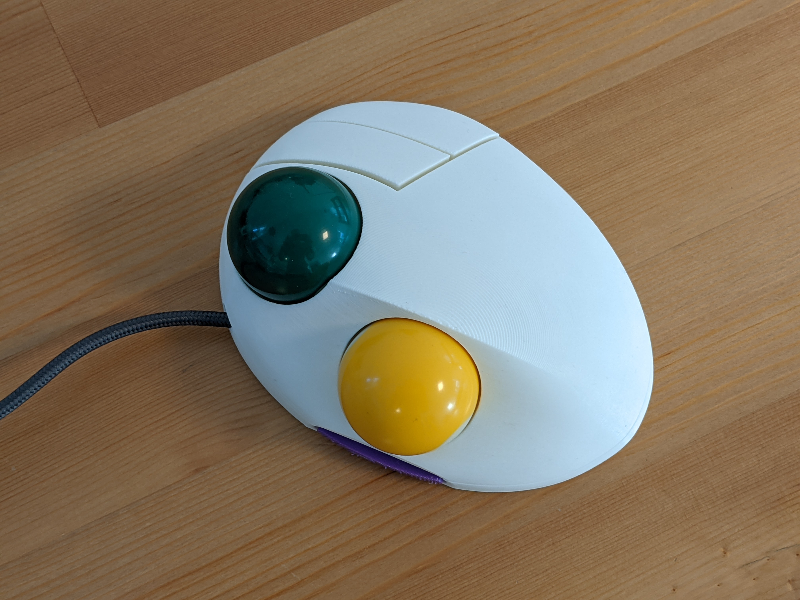
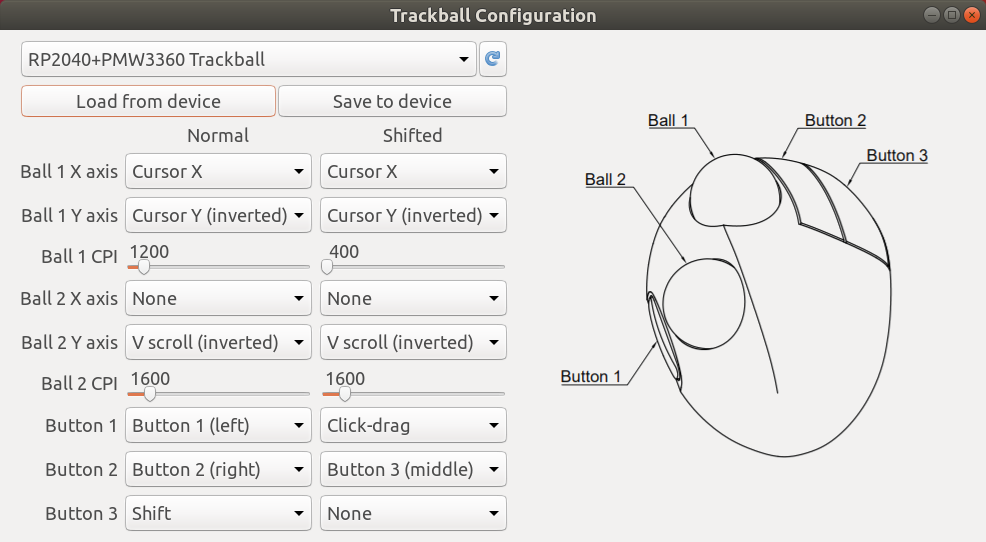
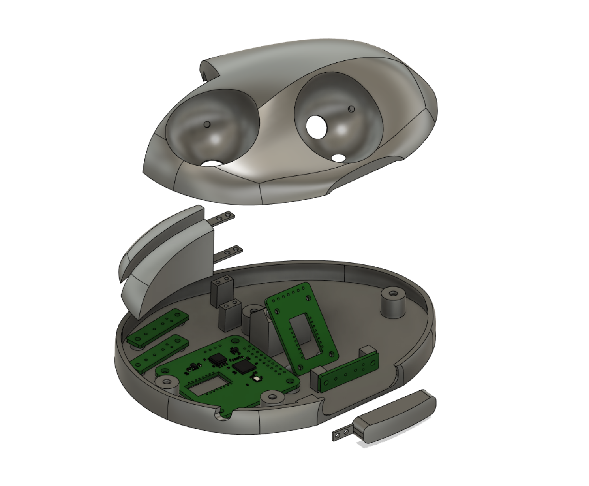
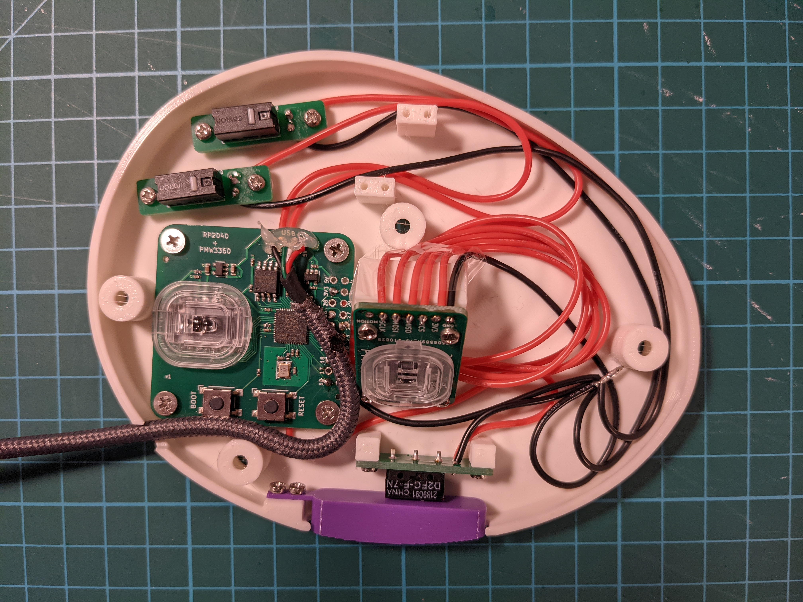

# DIY two-ball trackball

This repository contains design files and code that can be used to make a fully programmable two-ball, three-button USB trackball that looks like this:

It uses the following components:

* two 38mm billiard balls
* two PMW3360 optical sensors
* [main PCB](https://github.com/jfedor2/rp2040-pmw3360)
* [second sensor PCB](https://github.com/jfedor2/pmw3360-breakout)
* [button switch mount PCBs](https://github.com/jfedor2/mouse-switch-mount-pcb)
* [3D printed case](3d-models)
* Omron D2FC switches (or any switches with the same footprint)
* 2.5mm zirconium oxide (or silicon nitride) bearing balls
* M3x4 screws for mounting the main PCB
* M2x4 screws for mounting the buttons and the secondary PCBs
* 3x10mm wood screws for assembling the case
* USB cable (cut off the device end and solder the wires directly to the PCB)

The main PCB uses the RP2040 chip from Raspberry Pi. The firmware supports remapping of ball and button functions using a configuration tool without the need to recompile the source code. All the configuration is stored on device, so the configuration tool is only needed to change the settings, not during normal use.

Each ball can be configured to control the cursor or to scroll, with independent CPI setting. High resolution scroll is supported (at least on Windows).

So far I only tested the configuration tool on Linux, but it should in theory run on Windows and Mac as well. I will try to provide ready-to-use packages in the future.

The provided [UF2 file](firmware/trackball.uf2) can be used to flash the firmware onto the device. When first connected, a "RPI-RP2" drive will show up and you flash the chip by copying the UF2 file to that drive. If you want to flash it again, hold the BOOT button and press the RESET button on the board.

I printed the case parts with 0.2mm layer height and no supports, though you might want to enable supports for the top part if you're having trouble printing it without them.

The pin numbers are defined at the top of [trackball.cc](firmware/src/trackball.cc).

